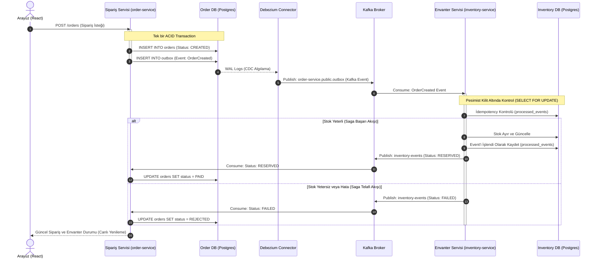

# Event-Driven Order Management (Saga & CDC)

Bu proje, mikroservis mimarisinde dağıtık veri tutarlılığını sağlamak üzere **Saga (Choreography)** ve **Transactional Outbox** desenlerini kullanan, **CDC (Change Data Capture)** temelli uçtan uca bir sipariş ve envanter yönetim sistemidir.

Proje bünyesinde Spring Boot (Java), Apache Kafka, Debezium, PostgreSQL ve React + Redux Toolkit teknolojileri kullanılmıştır.

---

## 🏗️ Dağıtık Mimari ve Akış Şeması

Aşağıdaki şemada, bir sipariş oluşturulduğunda Debezium ve Kafka üzerinden tetiklenen CDC akışı ile asenkron Saga Telafi (Compensating) mekanizmasının işleyişi gösterilmiştir:



---

## 🌟 Temel Mimariler ve Özellikler

### 1. Transactional Outbox & CDC (Debezium)
Sipariş servisinde veri tabanına sipariş yazılırken, aynı transaction içerisinde outbox tablosuna da bir olay (event) kaydı eklenir (Double-Write problemi önlenir). **Debezium**, Postgres WAL (Write-Ahead Log) loglarını dinleyerek bu outbox olayını yakalar ve Kafka'nın `order-service.public.outbox` konusuna güvenli bir şekilde yazar.

### 2. İdempotent Tüketici (Idempotent Consumer)
Envanter servisi, mükerrer olay tüketimini önlemek için gelen her outbox olay kimliğini (`event_id`) `processed_events` tablosunda aratır. Eğer olay daha önce işlenmişse envanter adımı tekrarlanmadan güvenli bir şekilde atlanır.

### 3. Ölü Mektup Kuyruğu (Dead Letter Queue - DLQ)
Çözümlenemeyen veya yapısal olarak bozuk olan mesajların (poison pill) kuyruğu tıkamasını engellemek amacıyla envanter servisinde bir **DLQ** yapısı kurulmuştur. 
* Hatalı mesajlar otomatik olarak `order-service.public.outbox.DLQ` konusuna yönlendirilir.
* Geçici hatalar için 2 saniye aralıklarla 3 kez yeniden deneme (retry) yapılır.

### 4. Otomatik Outbox Temizleme Görevi (Cleanup Job)
Sipariş servisi içerisinde her gün sabaha karşı **04:00 AM**'de (`cron = "0 0 4 * * *"`) çalışan bir scheduler mevcuttur. Bu görev, veri tabanının şişmesini önlemek amacıyla 24 saatten eski outbox kayıtlarını temizler.

### 5. Canlı Takip Arayüzü (Dashboard)
React + Redux Toolkit tabanlı, koyu tema ve modern glassmorphic tasarıma sahip ön yüz paneli:
* Siparişlerin Saga durumlarını (**İŞLENİYOR**, **ONAYLANDI**, **İPTAL**) canlı görselleştirir.
* Kritik stok seviyelerini (stok < 3) görsel uyarılarla gösterir.
* Her 3 saniyede bir otomatik olarak stok ve sipariş durumlarını günceller.

---

## 🚀 Çalıştırma Talimatları

### Gereksinimler
- Docker & Docker Compose
- Java 17+ / Maven
- Node.js & npm

### 1. Altyapıyı Başlatma (Kafka, Zookeeper, Postgres, Debezium)
Ana dizinde docker compose dosyasını çalıştırın:
```bash
docker compose up -d
```

### 2. Debezium Postgres Connector Kaydı
Debezium'un Postgres outbox tablosunu dinlemeye başlaması için connector tanımını API'ye gönderin:
```bash
curl -i -X POST -H "Accept:application/json" -H "Content-Type:application/json" http://localhost:8083/connectors/ -d @debezium/order-connector.json
```

### 3. Servisleri Başlatma
Her bir servisi kendi klasörüne giderek başlatın:

**Sipariş Servisi (order-service):**
```bash
cd services/order-service
./mvnw spring-boot:run
```

**Envanter Servisi (inventory-service):**
```bash
cd services/inventory-service
./mvnw spring-boot:run
```

**React Ön Yüz Paneli (frontend):**
```bash
cd frontend
npm install
npm run dev
```

Arayüz varsayılan olarak **`http://localhost:5174/`** (veya `5173`) portu üzerinden yayına başlayacaktır. Arayüzü açarak yeni siparişler gönderebilir, stokların ve Saga durumunun asenkron olarak nasıl güncellendiğini canlı izleyebilirsiniz.
